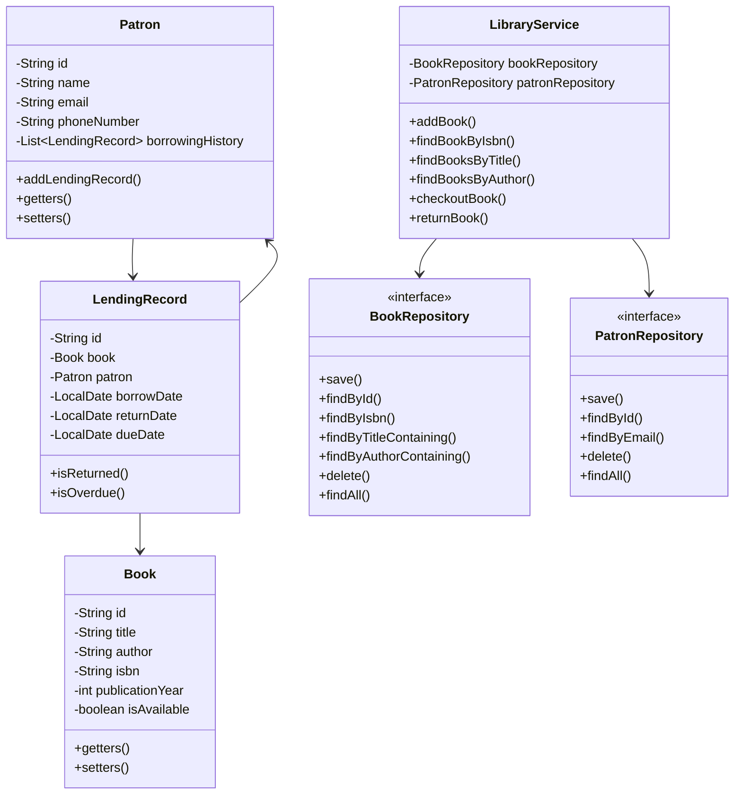

# Library Management System

A Java-based Library Management System that demonstrates Object-Oriented Programming (OOP) principles, SOLID principles, and design patterns.

## Features

- Book Management (add, remove, update, search)
- Patron Management
- Lending Process (checkout and return)
- Inventory Management

## Class Diagram



## Design Patterns Used

1. **Repository Pattern**: Used for data access abstraction (BookRepository and PatronRepository)
2. **Service Layer Pattern**: Implements business logic in LibraryService

## SOLID Principles Implementation

1. **Single Responsibility Principle**: Each class has a single responsibility
   - Book: Represents book data
   - Patron: Manages patron information
   - LendingRecord: Handles lending transaction data
   - LibraryService: Manages business logic

2. **Open/Closed Principle**: The system is open for extension but closed for modification
   - Repository interfaces allow for different implementations
   - New features can be added without modifying existing code

3. **Interface Segregation**: Repository interfaces are specific to their domain
   - BookRepository for book operations
   - PatronRepository for patron operations

4. **Dependency Inversion**: High-level modules depend on abstractions
   - LibraryService depends on repository interfaces, not concrete implementations

## Getting Started

### Prerequisites

- Java JDK 17 or later
- Maven
- IDE (IntelliJ IDEA recommended)

### Building the Project

```bash
mvn clean install
```

### Running Tests

```bash
mvn test
```

## Project Structure

```
src/
├── main/
│   └── java/
│       └── com/
│           └── library/
│               ├── model/
│               │   ├── Book.java
│               │   ├── Patron.java
│               │   └── LendingRecord.java
│               ├── repository/
│               │   ├── BookRepository.java
│               │   └── PatronRepository.java
│               └── service/
│                   └── LibraryService.java
└── test/
    └── java/
        └── com/
            └── library/
                └── service/
                    └── LibraryServiceTest.java
```

## Future Enhancements

- Multi-branch support
- Reservation system
- Book recommendation system
- Fine calculation for overdue books
- Email notifications